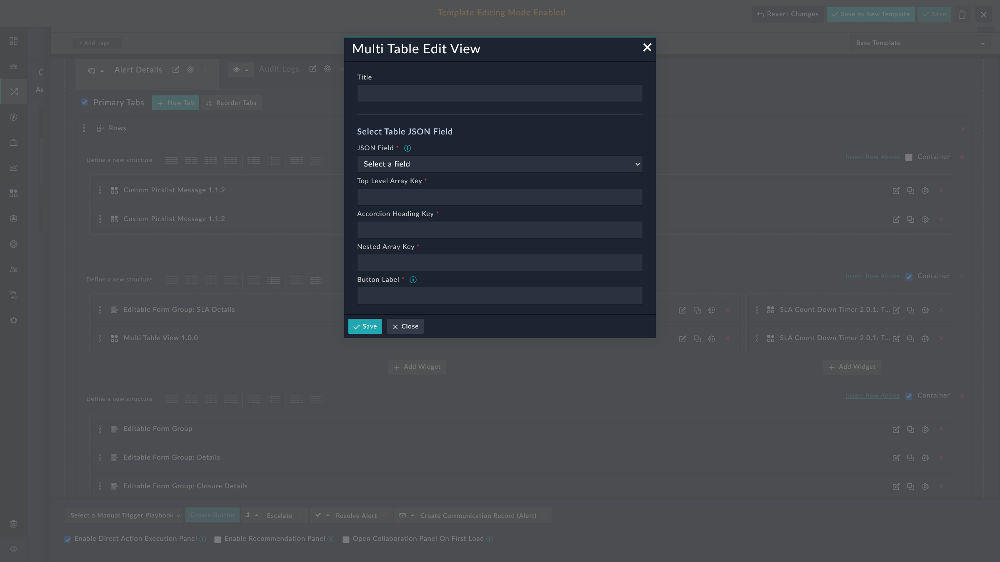

| [Home](../README.md) |
|----------------------|

# Installation

1. To install a widget, click **Content Hub** > **Discover**.
2. Search for the **Multi-table view** widget.
3. Click the **Multi-table view** widget card.
4. Click **Install** on the lower part of the screen to begin installation.

# Configuration

The following table lays out necessary information to customize this widget.

| Field Name                | Description                                                           |
|---------------------------|-----------------------------------------------------------------------|
| **Title**                 | Title displayed at the top of the rendered widget.                    |
| **JSON Field**            | Field in the module where the JSON data is stored and updated.        |
| **Top Level Array Key**   | The top-level array in the JSON structure (e.g., `"products"`).       |
| **Accordion Heading Key** | Field used as the title for each accordion section.                   |
| **Nested Array Key**      | Key used to render rows in each accordion table (e.g., `"versions"`). |
| **Button Label**          | Label displayed on the action button (e.g., `"Update Datacenters"`).  |

## Next Steps

| [Usage](./usage.md) |
|---------------------|
